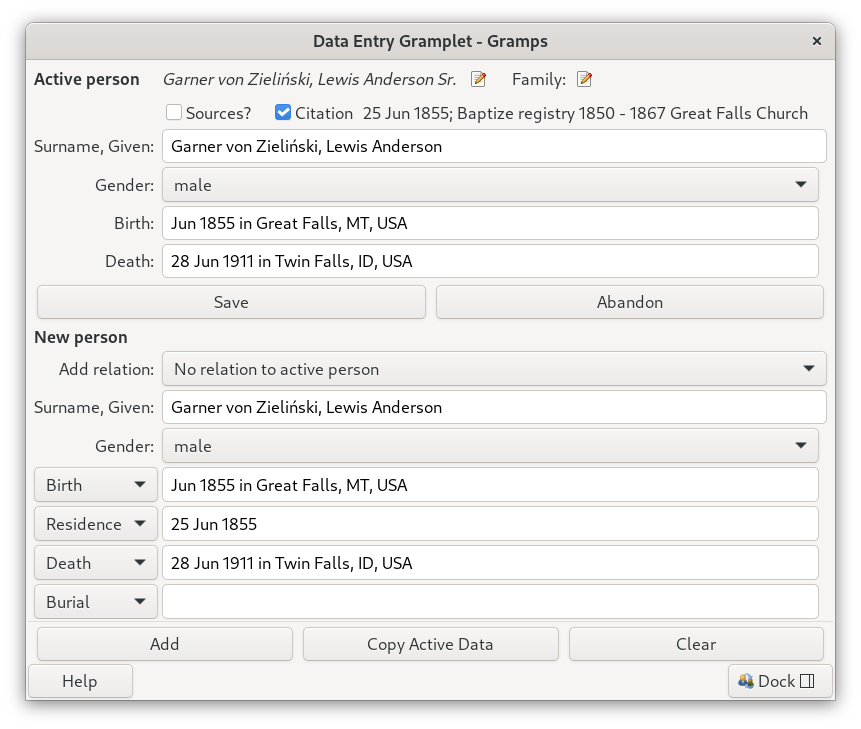

# Data Entry Gramplet

Add people to your family tree quickly, without opening the full editors. Without endless streams of object selection dialogs and windows.  

Look at the active person, change a few fields, and add a new person to them as a parent, spouse, sibling or child, together with up to four events (birth, residence, death, burial, or any other standard type) and their sources or a citation.

Works in any Gramps view that shows Person gramplets, such as the Relationships, Person or Pedigree views.

## Getting started

1. Install the addon with Gramps' Addon Manager and restart Gramps.
2. Open a Person view. In the sidebar or bottombar, open the Gramplet Bar menu and choose **Add a gramplet → Data Entry**. It can also be detached into its own window.
3. Select a person in the view. Their data appears in the **Active person** block at the top.

## The form

The form has two sections.

**Active person** shows whoever is selected in the view: name, gender, birth, death and a source for each. The edit buttons next to the name and next to *Family:* open the Gramps editors for the Person or Family respectively. You can change the fields here and press the  <kbd>Save</kbd> button. Save updates the name, gender, birth and death and their sources only.

**New person** is what you fill in to add a person to the Tree:

| Field | What it does |
|---|---|
| **Add relation** | How the new person relates to the active person: *No relation*, *Parent*, *Mother*, *Father*, *Spouse*, *Wife*, *Husband*, *Sibling* or *Child*. |
| **Surname, Given** | Type the surname, a comma, then the given names. |
| **Gender** | Needed for some relations (see *If something is refused*). |
| Four **event rows** | A type menu, a *date in place* field and a Source field. |

Buttons at the bottom of the gramplet always stay in view:

* The <kbd>Add</kbd> button adds the new person to the tree.
* The <kbd>Copy Active Data</kbd> button copies the active person's data into the New person block, so you can add a similar person (a sibling, or a child with the same surname) by changing a few fields.
* The <kbd>Clear</kbd> button empties the New person block. It keeps your event types.

### Dates and places
Type a date, then the word *in*, then a place: `1855-06-21 in Great Falls, MT`. The date can be typed the way you normally enter dates in Gramps. The word *in* is translated in other languages. A place that does not exist yet is created; otherwise the existing place is used.

### The four event rows
Each row has a pop-up menu for the event type. They start as **Birth, Residence, Death, Burial**. Pick any other standard type, for example Baptism, Census or Marriage. Your choices are remembered (see *Your settings*).

* Leave a row empty and no event is created for it.
* The first row set to *Birth* becomes the person's birth event, and the first row set to *Death* becomes the death event. Any other row is added as an ordinary event.

### Sources or a citation
Under the Active person title you choose how new records are sourced. **Enter Sources**, **Select Citation** and **None** are a pick-one-of-three: choosing one always deselects the others.

* **Enter Sources** selected: each Source field becomes a text entry. Type a title in the ones you want sourced and leave the rest empty. Each source is found by its exact title, or created if there is none, and cited on that person or event.
* **Select Citation** selected: Gramps' citation selector opens. Choose one **citation** (expand a source to see its citations; picking a source itself does not count). It is shown beside the radio button as *Date; Volume/Page; Source title*. Every Source field is replaced by a **Use citation** check box; tick the ones you want the citation attached to and leave the rest unticked — the citation is not attached anywhere by default.
* **None** selected: every Source field is hidden. Nothing is sourced and no citation is attached.

If you close the selector without choosing a citation, selection reverts to Enter Sources. Selecting Enter Sources or None forgets the citation (and unticks every **Use citation** box). A ticked **Use citation** box is also a one-time choice: it unticks itself again once you press <kbd>Add</kbd> or <kbd>Save</kbd>, so the next entry starts unticked.

When a citation is chosen, <kbd>Copy Active Data</kbd> also puts the citation's date into the *Residence* row. That is handy for census records: choose the census citation and the residence date is filled in for you.

## Examples
### Add a child
1. Select the parent in the view.
2. Set *Add relation* to *Add as a Child*, type the name and gender.
3. Fill in the events you know and press <kbd>Add</kbd>.

If the parent has no family yet, one is created for you.

### Record a census for a new person
1. Select <kbd>Select Citation</kbd> and choose the census citation.
2. Type the name, then press <kbd>Copy Active Data</kbd> if the person is similar to the active one.
3. Check the Residence date, add other details, tick **Use citation** next to the Residence row (and anywhere else the citation applies), and press <kbd>Add</kbd>.

## Unsaved edits
If you type in the Active person block, the <kbd>Abandon</kbd> button turns red. Hover over it to see which fields have unsaved changes and whose they are.

While it is red, the block does not follow the active person, and <kbd>Add</kbd> relates the new person to the person being edited, not to whoever is selected now. Press <kbd>Save</kbd> to keep the changes or <kbd>Abandon</kbd> to discard them and reload the block.

## If something is refused
If Add cannot be completed, you get a message and **nothing is saved**. Fix the problem and press Add again; no partial person is left behind.

| Message | What to do |
|---|---|
| Please set an active person | Select someone in the view first. |
| Please provide a name | Fill in the surname and/or given name. |
| Please set gender on Active person | To add a child to someone with no family yet, the parent's gender must be known. |
| Please set the new person's gender | Set *Gender* when adding a Parent, or a Spouse to someone whose gender is not known. |
| Same genders on Active and new person | The gramplet does not add a spouse of the same gender. Use Gramps' Edit Family dialog for that family. |

Each Add or Save is one step in Gramps' **Edit → Undo** history.

## Your settings
The event types you choose are saved in `DataEntryGramplet.ini`, in the folder containing the addon (for example `~/.gramps/gramps60/plugins/DataEntryGramplet/` on Linux):

```ini
[gramplet]
event_type_row2='21:Census'

[meta]
plugin_id='Data Entry Gramplet'
schema_version='2'
```

Each value is the type's number and its English name. If they do not match Gramps' current list, that row goes back to its default. To reset all four menus, delete the file; it is recreated. If you update or reinstall the addon, pick your event types again if they were reset.

## Points of interest
* The form fits down to about 315 pixels wide; below that it scrolls sideways. Add, Copy Active Data and Clear always stay at the bottom.
* Only standard event types are offered, not custom ones.
* One citation goes on everything a single Add creates. To cite different records differently, add them separately.
* Sources and places are matched by their exact title.

## More information
The Gramps wiki page for this addon:
* [Addon:DataEntryGramplet](https://gramps-project.org/wiki/index.php/Addon:DataEntryGramplet)

## Credits and license
Copyright 2007-2011 Douglas S. Blank and Gary Burton; 2026 Brian McCullough. Released under the GNU General Public License, version 2 or (at your option) any later version. 
Generated-by: Claude Sonnet 5 (claude-sonnet-5), Anthropic
Prompts: layout, event rows, citation and packaging requests made in
chat; guidelines: gramps-project/gramps AGENTS.md and the Gramps
"AI generated code" policy.
