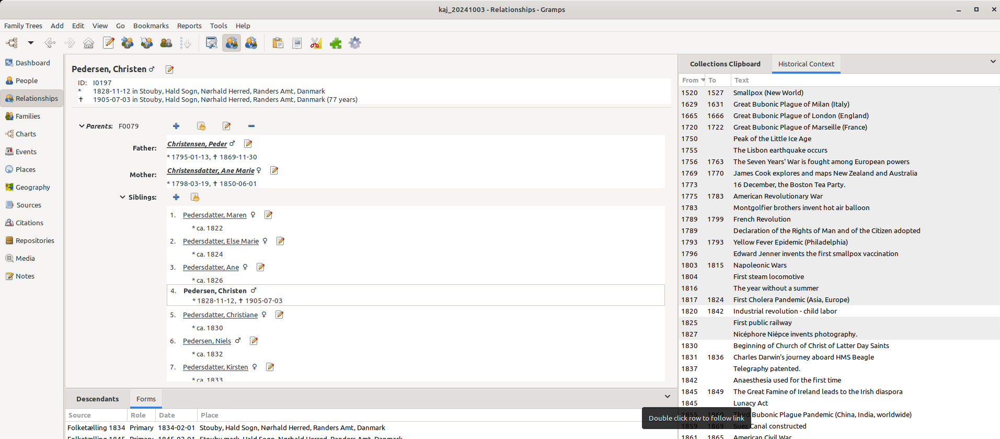
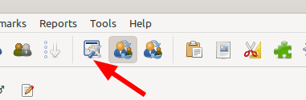
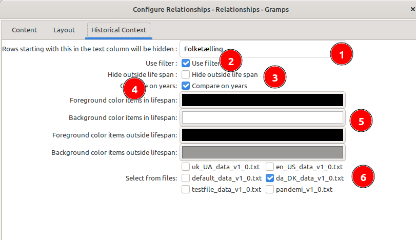

### Histtory Context gramplet

 
Gramplet to display historical events with the year they happened, and optionally the year  they ended.

A double-click on a row will open your browser at the provided Link

The gramplet works on the People and the Relationship Category view and will use the birth and death of the active person.

If either of the dates are missing the gramplet assumes a life span of 100 years
 
The data for the gramplet comes from a CSV file, which can be edited with a normal editor.

The Format is:

`from;to;event;link to event`

example:

1789;1797;George Washington;https://en.wikipedia.org/wiki/George_Washington

Date can be written in a variety of formats, including "Today" for ongoing events.

The file name is `<locale>_data_v1_0.txt `e.g. `da_DK_data_v1_0.txt` for Denmark
Currently only four files are provided, `da_DK_data_v1_0.txt` and `en_US_data_v1_0.txt` which simply is a list of American presidents.

The third is `deafult_data_v1_0.txt`which will be used, if there isn't any data file for your language.

The fourth file is `custom_v1_0.txt`which can be used for adding your own data, which will be merged into the view.

You can add and use any CSV delimited file, as long as it ends with '_v1_0.txt´

## Options

The options can be accessed by the settings for the view:

1 This string can be used to filter out text. If you set this to "Cen" all lines where the tect starts with "Cen" will be filtered out (e.g.Census as well as "Century"

2 If you check this box, your filter will be active

3 This checkbox decides whether you will see all events or only those in your active persons life span

4. Whether you will use full dates or full years for comparison between the event and your active persons life span

5 The foreground color for lines within a persons life span. There is a lot of applications, which let you convert a chosen colour to a HTML text string. I use KcolorChooser

6 The background colour for lines within the active persons life span
 
7  The foreground colour for lines outside the active persons life span

8 The background colour for lines outside the active persons life span

9 Files you choose to include in the timeline, Any files ending in _data_v1_0.txt will be listed, but it needs to hold data in the above format, in order to work.