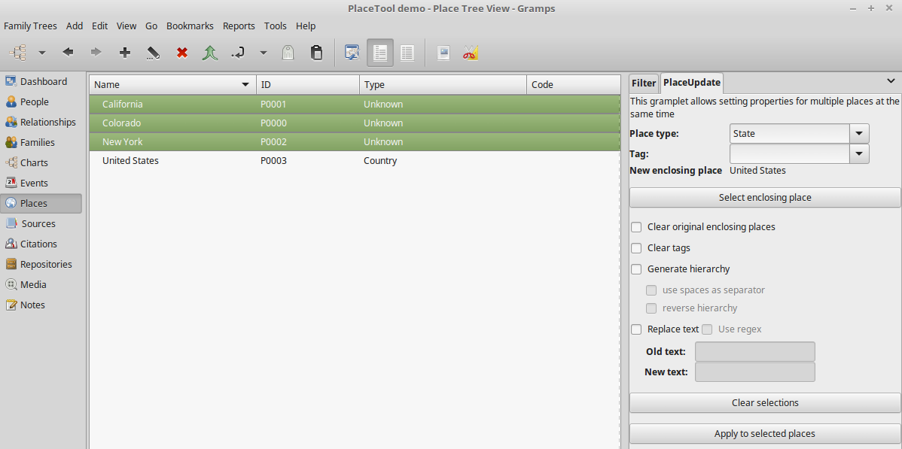
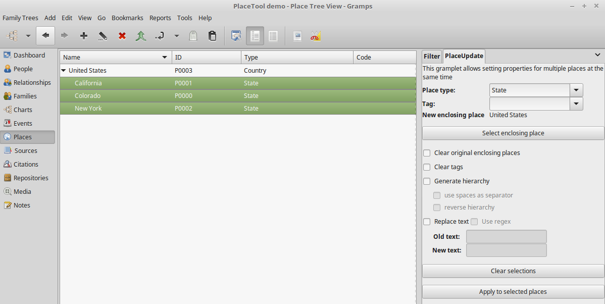

PlaceUpdate
-----------
Author: kari.kujansuu@gmail.com
(19 Jan 2020)

Gramplet to change properties of multiple places at the same time.
The properties that can be changed are:

- place type
- tag
- enclosing place

Place names can be edited by substituting substrings with new values.

The gramplet can also generate a place hierarchy from place names or titles. 

The gramplet is installed on the gramplet pane of the Places view and the place list is used to select which places are affected.

The user interface looks like:

**Setting enclosing place**

For the enclosing place first select the place that should enclose the other places 
and click the "Select" button next to the "New enclosing place" label. The selected place will be displayed as the label of the button.
Then select any number of places that should  be enclosed by the first one
and click the "Apply to selected places" button. 

A place might already have an enclosing place. In that case the new place will be added
and the place will end up being enclosed by multiple places. This is quite OK but
you can also remove the previous enclosing places by checking the box "Clear original enclosing places".
This can e.g. be used to "move" the places under another place.

Attempts to set a duplicate enclosing place or a loop (so that a place contains itself) 
are quietly bypassed.

In the "Timespan" field you can specify relevant the date range if needed. This also affects the generated hierarchy (see below).

**Setting place type or tag**

You can also set the type of the selected places or assign any tag if needed.
The operations can be combined so that e.g. the place type and enclosing place can be set 
at the same time. Type and tag can be selected from pre-existing ones or you can type
a new name if needed.

Any existing tags can also be first removed if the "Clear tags" checkbox is marked. Otherwise
the new tag is added to the set of the tags for the places. 

If the enclosing place, type or tag is not specified, then the corresponding
setting is not changed.

**Generating a place hierarchy**

If a place name contains comma separated names then the gramplet can change this
to a place hierarchy. For example if the name is of the form "place1, place2, place3"
then two new places, place2 and place3 (with type "Unknown") are created, the name of the original place is changed to place1 and the places are put in the hierarchy "place1 < place2 < place3".

Duplicate place names at the same level are automatically merged. The original names
can also be separated by spaces instead of commas - but then you must be careful that
the names do not contain spaces.

The hierarchy can also be generated in reverse, e.g. the result can also be 
"place3 < place2 < place1" if the corresponding checkbox is marked.

The place type and tag setting affects only the original place.

If the original place is under another place or a new enclosing place is specified then the new hierarchy is placed under the enclosing place.

If a timespan is specified then it applies to all levels in the generated hierarchy.

**Editing place names**

The "Replace text" function allows substituting a specified text string in the place names with another. Regular expressions can also be used.

**Example**

Select "United States" as the new enclosing places and
select the three states. Set the place type to "State":

Click "Apply to selected places". The result is:

**Notes**

The "Clear selections" button will clear the form.

All changes are done under a transaction and they can be undone from the Gramps menu 
"Edit > Undo Setting place properties". 

This gramplet does not have direct support for filters. The "Filter" gramplet can be used to search for the places that need changes. 

This gramplet can only be added on the Places view and it requires Gramps 5.x.
