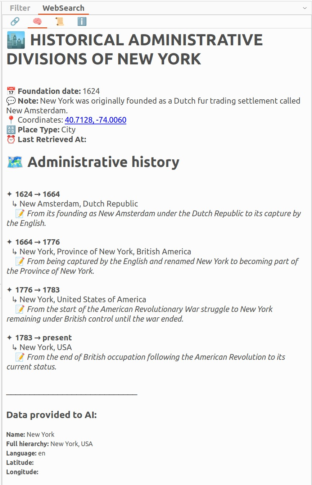
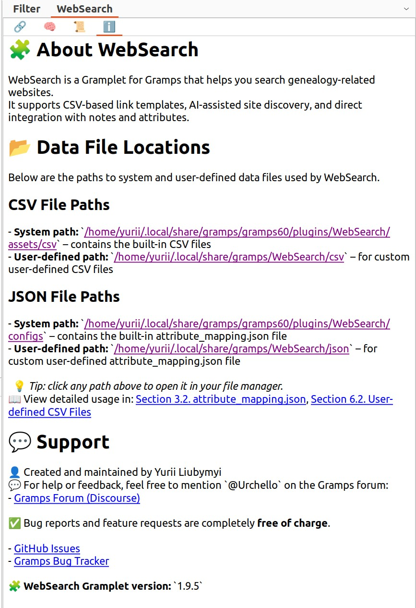
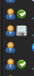

<!-- START doctoc generated TOC please keep comment here to allow auto update -->
<!-- DON'T EDIT THIS SECTION, INSTEAD RE-RUN doctoc TO UPDATE -->
**Table of Contents**  *generated with [DocToc](https://github.com/thlorenz/doctoc)*

- [📘 1. WebSearch Gramplet for Regular Users](#-1-websearch-gramplet-for-regular-users)
  - [1.1. What is WebSearch?](#11-what-is-websearch)
  - [1.2. Interface Overview (Tabs)](#12-interface-overview-tabs)
    - [1.2.1. The "Search Links" Tab](#121-the-search-links-tab)
      - [Table Columns Overview](#table-columns-overview)
      - [Source Type / Locale Icons](#source-type--locale-icons)
    - [1.2.2. The "Historical Administrative Divisions" Tab](#122-the-historical-administrative-divisions-tab)
    - [1.2.3. The "Activity Log" Tab](#123-the-activity-log-tab)
      - [Tracked Activity Types](#tracked-activity-types)
    - [1.2.4. The "Info" Tab](#124-the-info-tab)
  - [1.3. Basic Usage (Step by Step)](#13-basic-usage-step-by-step)
- [📘 2. WebSearch Gramplet for Advanced Users](#-2-websearch-gramplet-for-advanced-users)
  - [2.1. Purpose](#21-purpose)
  - [2.2. Navigation types and Supported Keys](#22-navigation-types-and-supported-keys)
    - [2.2.1. Navigation types](#221-navigation-types)
      - [Keys for the "People" Navigation Type:](#keys-for-the-people-navigation-type)
      - [Keys for the "Places" Navigation Type:](#keys-for-the-places-navigation-type)
      - [Keys for the "Families" Navigation Type:](#keys-for-the-families-navigation-type)
      - [Keys for the "Sources" Navigation Type:](#keys-for-the-sources-navigation-type)
    - [2.2.2 More details about some Keys](#222-more-details-about-some-keys)
      - [`place` VS `root_place`](#place-vs-root_place)
      - [The `middle` Key](#the-middle-key)
        - [Configuring "Middle Name Handling"](#configuring-middle-name-handling)
      - [Custom Keys](#custom-keys)
        - [Example of using a custom Key](#example-of-using-a-custom-key)
    - [2.2.3 Navigation Type Wildcards and Multiple Types](#223-navigation-type-wildcards-and-multiple-types)
      - [Example](#example)
  - [2.3. Configuration](#23-configuration)
    - [2.3.1. config.ini – General Configuration](#231-configini--general-configuration)
      - [Enable CSV Files (`websearch.enabled_files`)](#enable-csv-files-websearchenabled_files)
      - [Middle Name Handling (`websearch.middle_name_handling`)](#middle-name-handling-websearchmiddle_name_handling)
      - [Show Shortened URL (`websearch.show_short_url`)](#show-shortened-url-websearchshow_short_url)
      - [URL Compactness Level (`websearch.url_compactness_level`)](#url-compactness-level-websearchurl_compactness_level)
      - [URL Prefix Replacement (`websearch.url_prefix_replacement`)](#url-prefix-replacement-websearchurl_prefix_replacement)
      - [Use OpenAI (`websearch.use_openai`)](#use-openai-websearchuse_openai)
      - [AI API Key (`websearch.ai_api_key`)](#ai-api-key-websearchai_api_key)
    - [2.3.2. attribute_mapping.json – Attribute Mapping Rules](#232-attribute_mappingjson--attribute-mapping-rules)
      - [User-defined `attribute_mapping.json` File](#user-defined-attribute_mappingjson-file)
        - [Purpose and Protection from Data Loss](#purpose-and-protection-from-data-loss)
        - [Copy Example:](#copy-example)
        - [Directory Information Panel](#directory-information-panel)
      - [Attribute Mapping Rules](#attribute-mapping-rules)
      - [How Attribute Mapping Works](#how-attribute-mapping-works)
        - [Examples of Configuration and Expected Output](#examples-of-configuration-and-expected-output)
          - [Example 1: Integrating PersonFS FamilySearch Identifiers into WebSearch Gramplet](#example-1-integrating-personfs-familysearch-identifiers-into-websearch-gramplet)
          - [Example 2: Using the Same Identifier for a Different FamilySearch Link](#example-2-using-the-same-identifier-for-a-different-familysearch-link)
          - [Example 3: Using Custom Attributes in Search Queries](#example-3-using-custom-attributes-in-search-queries)
      - [Support for Multiple Contexts in UID Links: `ActivePerson`, `HomePerson`](#support-for-multiple-contexts-in-uid-links-activeperson-homeperson)
        - [What’s Implemented](#whats-implemented)
        - [How It Works](#how-it-works)
        - [Important Behavior](#important-behavior)
      - [Example UID Link Template for `uid-links.csv`](#example-uid-link-template-for-uid-linkscsv)
  - [2.4. User Interface](#24-user-interface)
    - [Tooltip Information](#tooltip-information)
  - [2.5. Context Menu](#25-context-menu)
    - [2.5.1 Add link to note](#251-add-link-to-note)
    - [2.5.2 Show QR-code](#252-show-qr-code)
    - [2.5.3 Copy link to clipboard](#253-copy-link-to-clipboard)
    - [2.5.4 Hide link for selected item](#254-hide-link-for-selected-item)
    - [2.5.5 Hide link for all items](#255-hide-link-for-all-items)
  - [2.6. Handling CSV Files](#26-handling-csv-files)
    - [2.6.1. Default CSV Files](#261-default-csv-files)
    - [2.6.2. User-defined CSV Files](#262-user-defined-csv-files)
      - [Purpose and Protection from Data Loss](#purpose-and-protection-from-data-loss-1)
      - [Usage Options](#usage-options)
      - [Supported CSV File Names](#supported-csv-file-names)
      - [Copy Example](#copy-example)
      - [Directory Information Panel](#directory-information-panel-1)
    - [2.6.3. Enabling Files](#263-enabling-files)
  - [2.7. AI Usage](#27-ai-usage)
    - [2.7.1 OpenAI Usage](#271-openai-usage)
  - [2.8. Community Contributions and Support](#28-community-contributions-and-support)
  - [2.9. Dependencies](#29-dependencies)
    - [Installing Dependencies](#installing-dependencies)
- [📘 3. WebSearch Gramplet for Developers](#-3-websearch-gramplet-for-developers)
  - [3.1. Quick Commands](#31-quick-commands)
    - [3.1.1 Updating the POT File](#311-updating-the-pot-file)
    - [3.1.2 Updating Translations](#312-updating-translations)
    - [3.1.3 Compiling Translations (Creating MO Files)](#313-compiling-translations-creating-mo-files)

<!-- END doctoc generated TOC please keep comment here to allow auto update -->


<hr style="height:4px; background-color:red; border:none; margin-top:48px; margin-bottom:48px;" />


# 📘 1. WebSearch Gramplet for Regular Users

This guide is for users who want to **search for genealogical information online** directly from Gramps — without any technical configuration.

WebSearch is a plugin (Gramplet) that appears as a **panel with several tabs**, giving you quick access to websites, history, descriptions, and documentation.


## 1.1. What is WebSearch?

WebSearch helps you search genealogy websites using the data from your family tree.  
You select a person, family, place, or source — and it generates **ready-to-use search links**.

No setup is needed. Just click and go.


## 1.2. Interface Overview (Tabs)

WebSearch includes **four tabs**, each showing different types of information.


### 1.2.1. The "Search Links" Tab

This is the **main tab** of the WebSearch Gramplet.  
It displays a list of ready-to-use search links for the currently selected person, place, family, or source in Gramps.

Each time you click on an entity, the links are updated automatically.  
To open a link — simply **double-click** on it.


#### Table Columns Overview

| Column             | Description                                                                                                                                       |
|--------------------|---------------------------------------------------------------------------------------------------------------------------------------------------|
| **Navigation Type**| These icons show **what kind of entity** the link applies to in Gramps. For example, if you're looking at a family, you'll see the family icon. Supported icons:                                  |
| **Source Type / Locale**| An icon or flag that shows **where the link comes from**: a built-in file, a specific country, a user directory etc. The list of supported icons and their meaning is provided in the table below.              |
| **Title**          | A short name for the website or service. Usually includes the source (e.g. FamilySearch, Google) and the used fields like (g,s,b,d).             |
| **Comment**        | Optional. Shows a description or note about the link if defined in the CSV file. Most links will leave this blank unless customized.             |
| **Website URL**    | The actual web address. **Double-click** to open in your default browser.                                                                         |

#### Source Type / Locale Icons

These icons appear in the **second column** and indicate **where the link comes from** or **how it was generated**:

| Icon                                  | Meaning                                                                                                                                                                 |
|---------------------------------------|-------------------------------------------------------------------------------------------------------------------------------------------------------------------------|
|        | The link was found in the **attributes** of the currently active object (e.g., a person).                                        |
|            | The link comes from **cross-links.csv** — cross-regional templates that don't belong to any specific country.                    |
|            | The link comes from **common-links.csv** — these are global/universal links, not tied to any country.                            |
|   | The link was **already visited** (visited status is remembered across sessions).                                                 |
|         | The link was found in the **Internet tab** of the active object (e.g., a person).                                                |
|     | The link was **saved by the user** from the WebSearch Gramplet into attributes or notes.                                         |
|             | The link was found in the **Notes tab** of the active object (e.g., a person).                                                   |
|              | The link comes from **static-links.csv** — static links manually added by the user, which do not contain any data keys.         |
|        | The link was loaded from a **user-defined directory**, not from the Gramplet’s built-in system files.                           |
|              | The link uses **special identifiers from attribute_mapping.json**, such as FamilySearch IDs. This is an advanced feature and is explained in the section [📘 2. WebSearch Gramplet for Advanced Users](#-2-websearch-gramplet-for-advanced-users). |
|         | A **national flag icon** indicates that the link is **region-specific**, and corresponds to a particular country code (like `ua`, `fr`, `de`, etc.). These links are stored in regional CSV files such as `ua-links.csv`. |


### 1.2.2. The "Historical Administrative Divisions" Tab

This tab shows a **summary of the selected place or person**, generated by AI.  



It includes:

- Historical background.
- Administrative hierarchy.
- Coordinates and location type. **Coordinates are clickable** — you can open them in your browser to verify whether they point to the correct location on a map. **Right-click** on the coordinates opens a context menu that allows you to **save them** to the currently active place in your Gramps database.
- What data was used to generate the description.


### 1.2.3. The "Activity Log" Tab


This tab displays a **history of your actions** in the WebSearch Gramplet.  
It helps you track what you’ve done recently — especially useful when you return after a break or want to review how a link was added or modified.

Each entry includes:
- the **timestamp**
- the **type of activity**
- and a short description or reference (like a link, file, or name)

---

#### Tracked Activity Types

| Activity Type                     | What it means                                                                                      |
|----------------------------------|-----------------------------------------------------------------------------------------------------|
| **Visited a link**               | You clicked and opened a web link in your browser.                                                 |
| **Saved a link to notes**        | You added a link to the "Notes" tab of the selected object.                                        |
| **Saved a link to attributes**   | You added a link to the "Attributes" tab of the selected object.                                   |
| **Loaded place history**         | You opened the "Historical Administrative Divisions" tab and loaded a summary for a place.         |
| **Skipped a domain**             | You marked a domain to be skipped or hidden from future suggestions.                               |
| **Hid a link for this object**   | You chose to hide a link for the current person/place/family/source only.                          |
| **Hid a link for all objects**   | You hid the same link globally, for all objects of any kind.                                       |
| **Edited attributes**            | You manually changed or added something in the "Attributes" tab of the selected object.            |
| **Edited notes**                 | You changed or added content in the "Notes" tab of the selected object.                            |


### 1.2.4. The "Info" Tab



This tab includes several sections:

| Section                      | Description                                                                                         |
|-----------------------------|-----------------------------------------------------------------------------------------------------|
| **About WebSearch**         | A short summary of what this Gramplet does and how it helps with genealogical web searches.         |
| **System Information**      | Checks whether required Python packages are installed:<br>– `openai` for AI features<br>– `qrcode` for QR codes<br>– `requests` for accessing external websites. Missing items are listed with installation tips, and nothing breaks — only specific features get disabled. |
| **File Locations**          | Shows full paths to both **system (Gramplet-internal)** and **user-defined** directories:<br>– CSVs: `common-links.csv`, `ua-links.csv`, etc.<br>– JSONs: `attribute_mapping.json`.<br>All paths are **clickable**, so you can open them directly in your file manager. |
| **Support and Credits**     | Contact details, support links, author information, and the currently installed version of WebSearch. |


## 1.3. Basic Usage (Step by Step)

1. **Start Gramps** and make sure the **WebSearch Gramplet** is installed.
2. **Add the Gramplet** to your right or bottom sidebar.
3. **Select any person, place, or family** in your family tree.
4. In the Gramplet, you’ll see several tabs — click through them to explore:

   - **Search Links** shows suggested websites (Google, FamilySearch, etc.).  
     → **Double-click** any link to open it in your browser.

   - **Historical Administrative Divisions** shows AI-generated summaries for places:  
     → To enable this, open WebSearch settings, enter your **API key**, **AI Model** , select a **AI Provider**, and **Save**.  
     → Then switch to the **Places** view, select a place, and wait a few seconds — a historical description will appeare.

   - Other tabs (like **Activity Log** and **Info**) help track your actions and view settings. Their purpose is intuitive — just click and explore.


<hr style="height:4px; background-color:red; border:none; margin-top:48px; margin-bottom:48px;" />


# 📘 2. WebSearch Gramplet for Advanced Users

## 2.1. Purpose

This Gramplet allows you to load and display a list of genealogical websites, configured through CSV files. These files contain patterns for generating URLs based on genealogical data such as name, birth year, death year, place, etc. (referred to as **Keys** throughout this document).

Each time the user activates a person, place, or other entity in Gramps, the list of updated links is dynamically generated. (These entities are referred to as **Navigation Types** throughout this document). These links contain pre-filled search queries relevant to the selected subject. This enables the user to quickly access ready-made search links to gather additional information for their research.


## 2.2. Navigation types and Supported Keys

### 2.2.1. Navigation types
The Gramplet supports the following **Navigation Types**, which correspond to the main sections of Gramps:
- **People**
- **Places**
- **Sources**
- **Families**
- **Events**
- **Citations**
- **Media**
- **Notes**
- **Repositories**

⚠️ Not all **Navigation Types** support data **keys**. Some of them only display static links, or links retrieved from **Attributes**, **Internet**, or **Notes** tabs (if available for that **Navigation Types**).

✅ Full **key** support — with values automatically inserted into the URL templates — is currently implemented for:
- **People**
- **Places**
- **Sources**
- **Families**

These **Navigation Types** support dynamic URL generation based on real entity data (e.g., names, years, locations). For other types, links may still appear if they are static or based on metadata (attributes, notes, etc.), but no substitution of template **keys** is performed.

#### Keys for the "People" Navigation Type:

- `given`: This field represents the first name of a person.
- `middle`: Middle name. This field represents the middle name of a person. The handling of middle names is configurable, and the exact mechanics for extracting and displaying the middle name are described in more detail in the Settings section of the Gramplet. In the settings, you can choose how middle names should be processed, such as separating the first and middle names or removing the middle name entirely.
- `surname`: This field represents the primary surname of a person.
- `birth_year_from`: The start year of the birth date range or span. This field is used when specifying a range for the birth year. If you are not working with a date range but a single birth year, this field will contain the year of birth. In that case, the birth_year_to will be the same value, as both values will represent the same year.
- `birth_year`: This field is filled in only when the birth date is a single, specific year (i.e., not part of a date range). If the birth date is a range or span (e.g., "born between 1900 and 1910"), this field will remain empty. The birth_year_from and birth_year_to fields will contain the start and end years of the range, while birth_year will be left blank.
- `birth_year_to`: The end year of the birth date range or span. Similar to birth_year_from, this field is used to define a range. If you are not using a range and instead have a specific birth year, this field will be the same as birth_year_from, indicating that both fields represent the same year.
- `birth_year_before`: The latest possible birth year before a given date.
- `birth_year_after`: The earliest possible birth year after a given date.
- `death_year_from`: The start year of the death date range or span. This field is used when specifying a range for the death year. If the death year is a specific date rather than a range, this field will contain that year, and the death_year_to field will be identical.
- `death_year`: This field is filled in only when the death date is a specific year (not part of a range). If the death date is within a range (e.g., "died between 1950 and 1960"), the death_year field will be empty. In this case, death_year_from and death_year_to will contain the start and end years of the range, while death_year will be left blank.
- `death_year_to`: The end year of the death date range or span. Like death_year_from, this field is used for ranges. If you're dealing with a specific death year, this field will match death_year_from, as both will contain the same value for a single date.
- `death_year_before`: The latest possible death year before a given date.
- `death_year_after`: The earliest possible death year after a given date.
- `locale`: The system locale detected in Gramps. Some examples of locale values: `en`, `de`, `fr`, `uk`, `es`, `it`, `pl`, `nl`, ...
- `birth_place`: This field stores the place where the person was born. It corresponds to the specific location selected from the list of available places. It represents the direct birth place, which could be a city, town, or any defined geographical area.
- `death_place`: Similar to `birth_place`, this field stores the place where the person passed away. It corresponds to the specific location selected from the list of available places. It represents the direct death place, which could also be a city, town, or any other defined geographical location.
- `birth_root_place`: This field represents the "root" birth place, which is the highest-level location in the place hierarchy. The `birth_root_place` encompasses the `birth_place`, meaning it includes the broader geographic area (e.g., a region, state, or country) that the specific `birth_place` falls under. The `birth_root_place` helps identify the broader context or administrative region to which the birth place belongs.
- `death_root_place`: Just like `birth_root_place`, this field represents the "root" death place, which is the highest-level location in the place hierarchy. It encompasses the `death_place`, representing the broader geographic region (e.g., region, state, or country) that the `death_place` is part of. The `death_root_place` provides context for the `death_place` by identifying the larger geographical area or administrative region it belongs to.

#### Keys for the "Places" Navigation Type:

- `place`: The specific location associated with an event (e.g., birth, death, marriage). For a more detailed explanation, including a visual demonstration, see [**Keys for the "People" Navigation Type**](#keys-for-the-people-navigation-type).
- `root_place`: The highest-level location in the place hierarchy that encompasses the `place`. For a more detailed explanation, including a visual demonstration, see [**Keys for the "People" Navigation Type**](#keys-for-the-people-navigation-type).
- `latitude`: The latitude of the place, if available.
- `longitude`: The longitude of the place, if available.
- `type`: The type of the place (e.g., city, village, region, etc.).
- `title`: The hierarchical title representation of the place.
- `underscored_place`: Place in format like this: New_York. Similar formats are often used in urls.
- `locale`: The system locale detected in Gramps. Some examples of locale values: `en`, `de`, `fr`, `uk`, `es`, `it`, `pl`, `nl`, ...

#### Keys for the "Families" Navigation Type:

- `father_given` – This field represents the first name of the father.
- `father_middle` – Middle name. This field represents the middle name of the father. The handling of middle names is configurable, and the exact mechanics for extracting and displaying the middle name are described in more detail in the Settings section of the Gramplet.
- `father_surname` – This field represents the primary surname of the father.
- `father_birth_year_from` – The start year of the birth date range or span for the father. If a specific birth year is known, this field will contain that value.
- `father_birth_year` – This field is filled in only when the birth date is a single, specific year (i.e., not part of a date range). If the birth date is a range or span (e.g., "born between 1850 and 1860"), this field will remain empty.
- `father_birth_year_to` – The end year of the birth date range or span for the father. If a specific birth year is known, this field will be the same as `father_birth_year_from`.
- `father_birth_year_before` – The latest possible birth year before a given date.
- `father_birth_year_after` – The earliest possible birth year after a given date.
- `father_death_year_from` – The start year of the death date range or span for the father. If a specific death year is known, this field will contain that value.
- `father_death_year` – This field is filled in only when the death date is a single, specific year (i.e., not part of a range).
- `father_death_year_to` – The end year of the death date range or span for the father. If a specific death year is known, this field will be the same as `father_death_year_from`.
- `father_death_year_before` – The latest possible death year before a given date.
- `father_death_year_after` – The earliest possible death year after a given date.
- `father_birth_place` – The place where the father was born. Represents a direct birth place, which could be a city, town, or other defined geographical area.
- `father_death_place` – The place where the father passed away. Represents a direct death place, which could be a city, town, or other defined geographical location.
- `father_birth_root_place` – The "root" birth place, representing the highest-level location in the place hierarchy (e.g., a region, state, or country).
- `father_death_root_place` – The "root" death place, representing the highest-level location in the place hierarchy (e.g., a region, state, or country).
- `mother_given` – This field represents the first name of the mother.
- `mother_middle` – Middle name. This field represents the middle name of the mother, configurable in the Gramplet settings.
- `mother_surname` – This field represents the primary surname of the mother.
- `mother_birth_year_from` – The start year of the birth date range or span for the mother. If a specific birth year is known, this field will contain that value.
- `mother_birth_year` – This field is filled in only when the birth date is a single, specific year (i.e., not part of a date range).
- `mother_birth_year_to` – The end year of the birth date range or span for the mother. If a specific birth year is known, this field will be the same as `mother_birth_year_from`.
- `mother_birth_year_before` – The latest possible birth year before a given date.
- `mother_birth_year_after` – The earliest possible birth year after a given date.
- `mother_death_year_from` – The start year of the death date range or span for the mother. If a specific death year is known, this field will contain that value.
- `mother_death_year` – This field is filled in only when the death date is a single, specific year (i.e., not part of a range).
- `mother_death_year_to` – The end year of the death date range or span for the mother. If a specific death year is known, this field will be the same as `mother_death_year_from`.
- `mother_death_year_before` – The latest possible death year before a given date.
- `mother_death_year_after` – The earliest possible death year after a given date.
- `mother_birth_place` – The place where the mother was born. Represents a direct birth place, which could be a city, town, or other defined geographical area.
- `mother_death_place` – The place where the mother passed away. Represents a direct death place, which could be a city, town, or other defined geographical location.
- `mother_birth_root_place` – The "root" birth place, representing the highest-level location in the place hierarchy (e.g., a region, state, or country).
- `mother_death_root_place` – The "root" death place, representing the highest-level location in the place hierarchy (e.g., a region, state, or country).
- `marriage_year_from` – The start year of the marriage date range or span.
- `marriage_year` – This field is filled in only when the marriage date is a single, specific year (i.e., not part of a date range).
- `marriage_year_to` – The end year of the marriage date range or span.
- `marriage_year_before` – The latest possible marriage year before a given date.
- `marriage_year_after` – The earliest possible marriage year after a given date.
- `marriage_place` – The place where the marriage took place.
- `marriage_root_place` – The "root" place of the marriage, representing the highest-level location in the place hierarchy.
- `divorce_year_from` – The start year of the divorce date range or span.
- `divorce_year` – This field is filled in only when the divorce date is a single, specific year (i.e., not part of a date range).
- `divorce_year_to` – The end year of the divorce date range or span.
- `divorce_year_before` – The latest possible divorce year before a given date.
- `divorce_year_after` – The earliest possible divorce year after a given date.
- `divorce_place` – The place where the divorce took place.
- `divorce_root_place` – The "root" place of the divorce, representing the highest-level location in the place hierarchy.
- `locale` – The system locale detected in Gramps. Some examples of locale values: `en`, `de`, `fr`, `uk`, `es`, `it`, `pl`, `nl`, ...

#### Keys for the "Sources" Navigation Type:
- `source_title`: Source title.
- `full_abbreviation`: The full content of the **Abbreviation** field in the source.
- `archive_code`: Archive code (e.g. `ДАЧО`, `TNA`, `NARA`), parsed from abbreviation, attribute, or repository.
- `collection_number`: Fund number (e.g. `142`), parsed from abbreviation or attribute.
- `series_number`: Inventory/series number (e.g. `1`), parsed from abbreviation or attribute.
- `file_number`: Case/file number (e.g. `15`), parsed from abbreviation or attribute.
- `locale`: The system locale detected in Gramps. Some examples of locale values: `en`, `de`, `fr`, `uk`, `es`, `it`, `pl`, `nl`, ...

### 2.2.2 More details about some Keys
#### `place` VS `root_place`
To better understand the difference between `place` and `root place`, see the example below:


- The **place** (e.g., "Los Angeles") refers to the specific city, town, or village.
- The **root place** (e.g., "USA") represents the highest-level geographical entity containing the place.

#### The `middle` Key
The `middle` **Key** is not used everywhere. It represents the **middle name** of a person and is typically relevant in cultures and naming conventions where middle names play an important role. Some cultures frequently use middle names, while others may not.
It is expected that users enter middle names in the **Given** field, separated by a space from the first name.
If other methods of storing middle names are used, such as including them in the **Surnames** field, the middle name detection mechanism will not work, and the 'middle' **Key** will remain empty.

##### Configuring "Middle Name Handling"
The way the `middle` **Key** is extracted from personal data **can be configured** in the settings interface. This setting is called **Middle Name Handling** and allows users to adjust how middle names appear in search queries.

For a more detailed explanation of this configuration, see the section [**config.ini – General Configuration**](#231-configini--general-configuration).

#### Custom Keys

Users can define their own **Keys** in the `attribute_mapping.json` file. These **Keys** will store values from the attributes of the active object. Currently, only **Person** attributes are supported.

Users can assign any name to the output **Key**. Here are some examples, though any other naming convention can be used:
- `FamilySearch.UID`
- `familysearch_person_id`
- `_FS-ID`

In the JSON file, these names should be specified in the `key_name` field. Users can utilize them like any other **Keys** listed in [**2.2. Navigation Types and Supported Keys**](#22-navigation-types-and-supported-keys).

##### Example of using a custom Key
A user-defined **Key** can be inserted into a URL template of a csv file as follows:
```
https://www.familysearch.org/en/tree/person/details/%(FamilySearch.UID)s
```

### 2.2.3 Navigation Type Wildcards and Multiple Types

WebSearch now supports advanced **navigation type syntax** in CSV files:

- **Multiple types**: Use a comma-separated list of navigation types in the `Navigation type` column:


```"People,Places"```

This makes it easier to define links that are relevant across different Gramps entities, without duplicating entries.

#### Example

```
Navigation type,Title,Is enabled,URL,Comment
"People,Places",Geo Search,1,https://example.com/search?q=%(place)s,Available for people and places
*,General Tool,1,https://example.com/tool?q=%(surname)s,Works for all types
```

ℹ️ The * wildcard expands automatically to all supported types listed in SupportedNavTypes.


## 2.3. Configuration

The WebSearch Gramplet uses two configuration files, each serving a specific purpose:

- **`config.ini`** – Stores general settings for the Gramplet, such as enabled CSV files, middle name handling, URL compactness level, and integration with external services.
- **`attribute_mapping.json`** – Defines rules for extracting and mapping attributes from Gramps entities to URL **Keys**.

These configuration files are located in the `configs` directory:

### 2.3.1. config.ini – General Configuration


The `config.ini` file contains various settings that control how the Gramplet operates. Here are the key options:

#### Enable CSV Files (`websearch.enabled_files`)
A list of CSV files that store website templates. The selected files define which sources are available for search queries.

#### Middle Name Handling (`websearch.middle_name_handling`)
Defines how middle names should be handled in URL templates:
- **Leave Alone** – Keep the middle name unchanged.
- **Separate** – Separate the first and middle names with a space.
- **Remove** – Remove the middle name entirely.

#### Show Shortened URL (`websearch.show_short_url`)
If enabled, URLs will be displayed in a shortened format. Corresponds to `websearch.show_short_url = true/false` in the configuration file.

#### URL Compactness Level (`websearch.url_compactness_level`)
Controls how URLs are formatted:
- **Shortest** – Minimal URL, no prefix and no extra parameters.
- **Compact - No Prefix, Keys Without Attributes** – Compact format, excludes attributes.
- **Compact - With Attributes** – Compact format, includes attributes.
- **Long** – Full URL with all details.

#### URL Prefix Replacement (`websearch.url_prefix_replacement`)
Allows users to replace or remove certain URL prefixes (e.g., removing `https://www.`).

#### Use OpenAI (`websearch.use_openai`)
If enabled, OpenAI will be used to generate additional genealogy research suggestions.

#### AI API Key (`websearch.ai_api_key`)
The API key required to use OpenAI services for generating additional research links.

Most settings take effect immediately. However, the following two settings require a restart, as OpenAI is only initialized once when the application starts:
- **Use OpenAI**
- **AI API Key**

For details on how OpenAI is used, the costs associated with it, and what data is transmitted, see the [See OpenAI Usage](#27-openai-usage) section.

### 2.3.2. attribute_mapping.json – Attribute Mapping Rules

📁 By default, the `attribute_mapping.json` file is loaded from the `configs/` directory inside the Gramplet.

However, users can create their own custom `attribute_mapping.json` file and place it in a special directory that is preserved across updates and reinstallations. 

#### User-defined `attribute_mapping.json` File

##### Purpose and Protection from Data Loss

WebSearch supports a user-defined `attribute_mapping.json` file stored in a special system-specific location that is protected from being lost during updates or reinstallation.

🛡️ This file is never overwritten or deleted, which makes it the recommended location for storing your personalized UID settings.

If the `json` directory does not yet exist, it will be created automatically the first time WebSearch is launched. This helps users quickly understand where to copy or create the `attribute_mapping.json` file.

In addition to JSON files, the user can also copy or create CSV files in another user-defined directory (read more about CSV [here](#262-user-defined-csv-files)).

The behavior of the user-defined `attribute_mapping.json` file is as follows:

- If the file exists, it overrides the default.
- Changes persist after updates.
- Allows customization for your own attributes.

##### Copy Example:

- Step 1: Copy from the system path: `{path to gramplet}/configs/attribute_mapping.json`
- Step 2: Paste to the user-defined path: `{path to user directory}/json/attribute_mapping.json`

##### Directory Information Panel

To help users navigate these locations, the Gramplet provides a dedicated information tab with clickable links to:

- System directories with default files
- User-specific directories

In the image below, the highlighted links correspond to the paths mentioned in **Copy Example**, showing both the system and user-defined directories.


#### Attribute Mapping Rules

The `attribute_mapping.json` file defines how attributes from Gramps **Navigation Types** are mapped to URL **Keys**. It ensures that specific fields (such as user-defined attributes) are correctly included in search queries.

Each entry follows this structure:

```json
[
  {
    "nav_type": "People",
    "attribute_name": "Military Service",
    "url_regex": ".*army.*",
    "key_name": "military"
  },
  {
    "nav_type": "Places",
    "attribute_name": "Old Name",
    "url_regex": ".*historic.*",
    "key_name": "old_name"
  }
]
```

- **`nav_type`** – The **Navigation Type** to which the attribute belongs (`People`, `Places`, `Sources`, etc.). **Currently, only attributes for `People` are supported.**
- **`attribute_name`** – The name of the attribute in Gramps.
- **`url_regex`** – A regular expression to match relevant URLs.
- **`key_name`** – The name of the **Key** that will be substituted in the URL template.

After making changes, restart Gramps for them to take effect.
By default, the attribute_mapping.json file contains a large number of pre-configured services, such as WikiTree, Geni, Geneee, Find a Grave, Wikipedia, and others. Most likely, if you need to use them, you will only need to adjust the attribute_name field, as the current one is a placeholder.
More details on how this mechanism works, including how identifiers from attributes are used in links, can be found [here](#how-attribute-mapping-works).

#### How Attribute Mapping Works

The URL templates added in CSV files are validated against the specified regex patterns. If a URL matches a defined pattern, the system will check whether the active person has an attribute with the name specified in `attribute_name`.
- If such an attribute exists, a new **Key** will be created with the name specified in `key_name`, containing the value from that attribute.
- This value will be inserted into the appropriate place in the URL from the CSV file.

##### Examples of Configuration and Expected Output

---

###### Example 1: Integrating PersonFS FamilySearch Identifiers into WebSearch Gramplet

Users who use the **PersonFS Gramplet** in Gramps have an attribute named **`_FSFTID`** for individuals in their database.  
This attribute stores the **FamilySearch unique identifier** that links a person in Gramps to their corresponding record in FamilySearch.

For example, let’s say a person is available in FamilySearch at the following external link:  
**`https://www.familysearch.org/en/tree/person/details/GP4V-3K8`**  
In this case, in the **Gramps database**, we expect this person to have an attribute **`_FSFTID`** with the value **`GP4V-3K8`**.

Now, let’s configure the **WebSearch Gramplet** to automatically generate FamilySearch profile links using this identifier.

**Step 1: Add the URL to a CSV file**
To integrate FamilySearch links into WebSearch, we need to modify one of the CSV files used by the Gramplet.  
For FamilySearch identifiers, the most suitable file is `uid-links.csv`, but technically, any regional CSV or even `common-links.csv` can be used.
Open `uid-links.csv` (or another preferred CSV file) and add the following line:

```
https://www.familysearch.org/en/tree/person/details/%(FamilySearch.personID)s
```
Here, instead of inserting a static FamilySearch ID, we use the custom **Key** **%(FamilySearch.personID)s**.
You can use a different **Key** name if you prefer.

**Step 2: Modify `attribute_mapping.json`**
Now, we need to configure how the WebSearch Gramplet extracts the FamilySearch ID (`_FSFTID`) from individuals in Gramps and assigns it to a **Key**.
Open the `attribute_mapping.json` file and add the following block:

```
{
  "nav_type": "People",
  "attribute_name": "_FSFTID",
  "url_regex": ".*familysearch\\.org/.*/tree/person/details/.*",
  "key_name": "FamilySearch.personID"
}
```

**Explanation of Each Field**

- **`nav_type`** → Always "People" because the attribute **`_FSFTID`** is stored at the individual level in Gramps.
- **`attribute_name`** → This is the **attribute name** in Gramps where the FamilySearch ID (`GP4V-3K8`) is stored.
- **`url_regex`** → A **regular expression (regex)** that matches the target FamilySearch URL format.
    - The beginning, ending, and locale parts of the URL are replaced with `.*`, which matches any characters of any length.
    - Dots (`.`) in URLs must be escaped with double backslashes (`\\.`).
    - This ensures the URL template remains flexible and works for different FamilySearch links.
- **`key_name`** → This is the custom **Key** name (`FamilySearch.personID`) we used in **Step 1**.

 ⚠ **Important JSON Formatting Rules**
- Each block in the JSON array must be separated by a comma, except the last one.
- No comma after the last block—otherwise, the JSON file will be invalid.

**Step 3: Save the Changes**
- Save `uid-links.csv` (or your chosen CSV file).
- Save `attribute_mapping.json`, ensuring there are no formatting errors.

**Step 4: Restart Gramps or Reload the WebSearch Gramplet**
- Either restart Gramps entirely or simply reload the WebSearch Gramplet to apply the changes.

**Step 5: Verify the Integration**
1. Find an individual in Gramps who has the `_FSFTID` attribute.
2. Click once on the person to activate them.
3. The WebSearch Gramplet should now automatically generate a link to their FamilySearch profile.
4. Double-click the link to open the FamilySearch profile page in your default browser.

From now on, all individuals with `_FSFTID` will automatically generate links to their FamilySearch profiles.  


This allows users to quickly navigate between Gramps and FamilySearch, enhancing research efficiency! 🚀

---

###### Example 2: Using the Same Identifier for a Different FamilySearch Link

Example 2 is a logical continuation of **Example 1**.  
We will use the same FamilySearch identifier but in a different URL — this time, a link to the person's genealogy tree on FamilySearch:

`https://www.familysearch.org/en/tree/pedigree/landscape/GP4V-3K8`

Since we have already configured the `_FSFTID` attribute in **Example 1**, we can reuse it for this new link.

**Step 1: Add the URL to a CSV file**
Open the CSV file (e.g., `uid-links.csv`) and add the following line:

`https://www.familysearch.org/en/tree/pedigree/landscape/%(FamilySearch.personID)s`

**Step 2: Modify `attribute_mapping.json`**

Add the following JSON block to `attribute_mapping.json`:

```
{
  "nav_type": "Person",
  "attribute_name": "_FSFTID",
  "url_regex": ".*familysearch\\.org/.*/tree/pedigree/landscape/.*",
  "key_name": "FamilySearch.personID"
}
```
**Alternative Approach: Using a Generalized Rule**

Instead of defining separate rules for different FamilySearch URLs, we can simplify the configuration by using a more general rule:

```
{
  "nav_type": "Person",
  "attribute_name": "_FSFTID",
  "url_regex": ".*familysearch\\.org/.*",
  "key_name": "FamilySearch.personID"
}
```

This removes the specific URL path that was different in both cases, making the rule more flexible and applicable to any FamilySearch link related to the person.

This example is fully analogous to Example 1 and does not require additional explanations.
Simply save the configuration files, restart Gramps or the WebSearch Gramplet, and enjoy the new automatically generated FamilySearch link.


---

###### Example 3: Using Custom Attributes in Search Queries

You can use any attributes you wish for this task. You can pass them as custom **Keys** inside URLs.  
For example, let’s assume you need to pass the value of the "Caste" attribute into a search query to refine search conditions.  
For simplicity, let’s use a Google search URL.

**Step 1: Add the URL to a CSV file**
Open your **CSV file** and add the following line:

```
https://www.google.com/search?q=%(caste)s %(surname)s %(given)s %(middle)s
```


This ensures that the search query will contain the **Caste, Surname, Given Name, and Middle Name** of the selected person.

**Step 2: Modify attribute_mapping.json**
Now, add the following JSON entry inside `attribute_mapping.json`:

```
{
  "nav_type": "Person",
  "attribute_name": "Caste",
  "url_regex": ".*google\\.com/search.*",
  "key_name": "caste"
}
```

**Step 3: Save and Test**
- Save both the modified CSV and JSON files.
- Restart Gramps or the WebSearch Gramplet to apply the changes.
- Select a person who has the "Caste" attribute in their profile.
- The WebSearch Gramplet will generate a Google search link containing their caste information.
- Click the link, and Google will refine the search results, showing not just generic results for "John Doe" but specifically those related to a particular caste.


🚀 This method allows you to dynamically generate search links using any attribute stored in Gramps, making your genealogy research more effective!


#### Support for Multiple Contexts in UID Links: `ActivePerson`, `HomePerson`

##### What’s Implemented

The **WebSearch Gramplet** now supports **multiple data contexts** for UID links. This allows you to substitute attributes from **multiple persons** within a single URL template.


##### How It Works

**Contexts** are prefixes for keys in the URL template that indicate which person the attribute should come from:

- `ActivePerson` — the person currently selected in the Gramps interface.
- `HomePerson` — the default "home person" set in the database settings.

URL templates can include:

- **Unprefixed keys** — default to `ActivePerson`  
  `%(Gedbas.ID)s` ≡ `%(ActivePerson.Gedbas.ID)s`

- **Prefixed keys** — explicitly indicate the context  
  `%(HomePerson.Gedbas.ID)s`

**JSON attribute mappings** can also include a `"context"` field to specify which person the attribute value belongs to.


##### Important Behavior

If a URL template includes keys from **multiple contexts** (e.g., `ActivePerson` and `HomePerson`), but only **some of those keys are filled**, the link **will not be displayed**.  
This prevents the generation of broken or incomplete URLs.


#### Example UID Link Template for `uid-links.csv`

```csv
People,WikiTree Connection,1,https://www.wikitree.com/index.php?title=Special:Connection&action=connect&person1Name=%(ActivePerson.WikiTree.ID)s&person2Name=%(HomePerson.WikiTree.ID)s
```

or using the default context shortcut:

```csv
People,WikiTree Connection,1,https://www.wikitree.com/index.php?title=Special:Connection&action=connect&person1Name=%(WikiTree.ID)s&person2Name=%(HomePerson.WikiTree.ID)s
```


## 2.4. User Interface


The Gramplet's interface consists of the following columns:

1. **Icons**: Displays the icon associated with the **Navigation Type** (e.g., People, Places, Sources).
   In addition to these, other icons may also be displayed, representing additional functionalities or link types. One of these icons are described in detail in [**Section 5. Context Menu**](#25-context-menu).
Double-clicking on a URL in the Gramplet opens the associated website in the default system browser. After a link has been opened, it is marked with another icon, indicating that it has already been visited. 



2. **Locale**: Shows the locale or region associated with the website. This field can be sorted alphabetically to help organize links by region. In addition to locale names, certain links are marked with specific icons to indicate their type:

    - **`🌍` COMMON_LOCALE_SIGN** – Represents general links that are **suitable for all regions**. These links are found in **`common-links.csv`**.
    - **`🆔` UID_SIGN** – Indicates links that use **custom Keys**. These **Keys** were primarily designed to retrieve **unique identifiers (UIDs)** from attributes, but users can repurpose them to store and pass any data. For example, a user could store **eye color** as an attribute and pass it as a custom key in a URL. These links are stored in **`uid-links.csv`**.
    - **`📌` STATIC_SIGN** – Represents **static links** that the user manually adds to **`static-links.csv`**. These are frequently used or favorite links that the user wants **permanent access** to.

3. **Title**: Represents the title assigned to the website. This field is sortable, allowing you to arrange links by their respective categories.  
   For ease of use, it is recommended to list the **Keys** used in the URL template by their initial letters, as shown in the screenshot. This way, you can add several similar links with different sets of input parameters and quickly navigate through them. This greatly simplifies the search and convenient use of different template variations.  

4. **Comment**: Provides additional information about the link. This field allows users to add custom notes regarding the purpose, source, or special usage of the link. Comments can help users quickly understand the context of each link without opening it. This field is optional and can be edited directly within the Gramplet.

  
   For example, the letters shown in the screenshot represent:
  - **g** - Given name
  - **m** - Middle name
  - **s** - Surname
  - **b** - Birth year
  - **d** - Death year

4. **URL**: The generated URL based on the data of the active individual, place, or source. This field can be sorted alphabetically, helping you easily organize the list of URLs. By double-clicking on a URL, you can open the associated website directly.

### Tooltip Information


When hovering over a row in the table, the tooltip will display:
- **Title**: The title assigned to the website.
- **Replaced**: The **Keys** that were successfully replaced with data from the active entity.
- **Empty**: **Keys** that did not have values and were replaced to empty.
- **Comment**: Any comment associated with the website. These comments can be included in a separate column in the CSV file, allowing you to add additional context or information about each link.

## 2.5. Context Menu


Right-clicking on an active link within the Gramplet opens the **context menu**, which provides additional actions for working with the selected link. The following options are available:

### 2.5.1 Add link to note
This option allows the user to add the selected link directly to a note in Gramps. This can be useful for storing references to relevant research materials, websites, or sources associated with a person, place, or event. The link will be saved in the notes section of the active entity.

After saving a link to a note, a **floppy disk icon** appears in the icons column, indicating that the link has been stored.  


Generated notes contain plain text only.

### 2.5.2 Show QR-code
Selecting this option generates and displays a **QR code** for the selected link. This enables users to quickly scan the QR code with a mobile device and open the link on a phone or tablet without manually copying and pasting it.


If the required qrcode library is not installed, a window will still open, but it will display a message indicating that the dependency is missing.


### 2.5.3 Copy link to clipboard
This option copies the selected link to the clipboard, allowing the user to easily paste it into another application, browser, or document. This is useful for quickly sharing or storing links outside of Gramps.

The **context menu** enhances usability by providing quick access to commonly used actions related to genealogy research links.

### 2.5.4 Hide link for selected item
This option allows the user to temporarily hide a specific link associated with the selected item in the Gramplet. The link is not deleted but will no longer be displayed until the user restores it. This can be useful for decluttering the interface by hiding irrelevant or less frequently used links.

### 2.5.5 Hide link for all items
This option hides all displayed links in the Gramplet, making the interface cleaner. Like the previous option, it does not delete the links but only removes them from view. This feature is helpful when the user wants to focus on other elements of the interface without being distracted by the list of links.

## 2.6. Handling CSV Files


### 2.6.1. Default CSV Files

The CSV files are loaded from the directory `assets/csv/` inside the Gramplet's directory. The filenames must end with `.csv`, and each file should follow the following format:
The Gramplet will automatically load these files and display the URLs based on the active entity (Person, Place, Source, ...).

**Is Enabled**: This column in the CSV file allows the user to enable or disable individual links without deleting them. This provides flexibility to manage which links are active while keeping all the available URLs in the file.

### 2.6.2. User-defined CSV Files

#### Purpose and Protection from Data Loss

WebSearch supports user-defined CSV files stored in a special system-specific location that is protected from being lost during updates or reinstallation.

🛡️ These files are never overwritten or deleted, which makes them the recommended location for storing your personalized links.

To help you distinguish such links, a spreadsheet icon  is displayed next to websites loaded from user-defined files.

If the directory does not yet exist, it will be created automatically the first time WebSearch is launched. This helps users quickly understand where to copy or create their own files.

#### Usage Options

The user can:

- **Copy existing CSV files** from the system directory to the user-defined directory and edit them freely.  
  ⚠️ **Note:** If the file names match, WebSearch will always prioritize the user-defined version. In this case, new links added to the default files during updates will not be applied.

- **Create new CSV files** — either with new names or using the supported file names hardcoded in the plugin.

#### Supported CSV File Names

- `common-links.csv` – Global links for all regions with automatic value substitution
- `uid-links.csv` – Links with substituted values from person attributes
- `static-links.csv` – Static links you want to keep at hand (recommended to copy into the user directory)
- `cross-links.csv` – Transregional links to websites with value substitution
- `{country_code}-links.csv` – Regional resources (e.g. `ua-links.csv`, `fr-links.csv`)
- `{country_code}-archive-links.csv` – Regional archives
- `{country_code}-community-links.csv` – Facebook/Telegram communities and more
- `{country_code}-forum-links.csv` – Regional forums

#### Copy Example

- Step 1: Copy from the system path: `{path to gramplet}/assets/csv/static-links.csv`
- Step 2: Paste to the user-defined path: `{path to user directory}/csv/static-links.csv`

#### Directory Information Panel

To help users navigate these locations, the Gramplet provides a dedicated information tab with clickable links to:

- System directories with default files
- User-specific directories

In the image below, the highlighted links correspond to the paths mentioned in **Copy Example**, showing both the system and user-defined directories.


### 2.6.3. Enabling Files
You can select which CSV files to use by enabling or disabling them in the Gramplet's settings.

## 2.7. AI Usage


### 2.7.1 OpenAI Usage
This section provides an overview of how OpenAI is integrated into the WebSearch Gramplet. It covers:
- **Usage of OpenAI**: The Gramplet interacts with OpenAI’s API to retrieve relevant genealogy websites based on user queries. The integration makes a **single API call** per request. OpenAI suggests **only those genealogy resources that are not already included** in the activated CSV files configured by the user.
- **Data Transmission**: OpenAI receives **only** the following information:
    - **Locales** from the CSV files used in WebSearch.
    - **A list of domains** from the activated CSV files.
    - **A list of domains that the user has marked as irrelevant**.
- **No data from the Gramps database is transmitted to OpenAI.**
- **Cost Considerations:** As of **March 18, 2025**, the average cost per request is **0.0091 USD** (0.91 cents). With this pricing, approximately **109 requests** can be made for **1 USD**.
- **Data Transmission**: When a request is made to OpenAI, the Gramplet sends a structured prompt describing the required genealogy resources.
- **Disabling OpenAI Integration:** Users can **disable** the use of OpenAI in the settings at any time. Additionally, they can remove the AI API key from the configuration. When OpenAI is disabled, the **AI-generated suggestions section will no longer appear** in the lower part of the Gramplet.
- **Disclaimer:** The author assumes **no responsibility** for the use of OpenAI within this Gramplet. The user **accepts all risks** associated with its usage, whatever they may be. By enabling OpenAI integration, the user acknowledges and agrees that all interactions with OpenAI are subject to OpenAI’s terms of service and privacy policies.

###7.2 Mistral Usage
Mistral is another AI service integrated into the WebSearch Gramplet. It provides similar functionality to OpenAI in generating suggestions for genealogy resources based on user queries.
- **Usage of Mistral**: Like OpenAI, Mistral makes a single API call per request and suggests genealogy websites not already included in the activated CSV files.
- **Data Transmission**: Mistral receives the same data as OpenAI, including the list of domains from the activated CSV files and irrelevant domains marked by the user. No Gramps database data is transmitted.
- **Disabling Mistral Integration**: Users can disable Mistral in the settings at any time, and if it’s disabled, the AI suggestions section for Mistral will not appear in the Gramplet.
- **Disclaimer**: The author does not take responsibility for the use of Mistral within this Gramplet. The user accepts all risks associated with Mistral usage. By enabling Mistral, the user acknowledges and agrees to Mistral’s terms of service.

## 2.8. Community Contributions and Support

I encourage users who add **publicly useful links** to their **CSV files** to also submit requests for adding these links directly via **commits**.

To contribute:
1. **Create an issue** on GitHub: [**WebSearch Issues**](https://github.com/jurchello/WebSearch/issues)
2. **Provide the necessary details**, including:
    - The **URL template** with the correct **key** placeholders
    - A **brief description** of the website
    - Any **specific navigation type or attributes** required

By submitting new links this way, **other users won’t need to do the same work again**, ensuring that all commonly useful genealogy search links are readily available in WebSearch Gramplet by default. 🚀

## 2.9. Dependencies

The WebSearch Gramplet works **without additional dependencies**, but certain **non-core features** require additional packages:

- **QR Code Generation** → Requires `qrcode`
- **OpenAI Integration** → Requires `openai`

### Installing Dependencies

Dependencies can be installed easily via **pip**, and the process is the same across all operating systems (**Windows, macOS, and Ubuntu**).

```
pip install qrcode
pip install openai
```

The core functionality of the WebSearch Gramplet remains fully operational even without these dependencies.


<hr style="height:4px; background-color:red; border:none; margin-top:48px; margin-bottom:48px;" />


# 📘 3. WebSearch Gramplet for Developers

## 3.1. Quick Commands

For developers working on the WebSearch Gramplet, here are some frequently used commands for quick access:

### 3.1.1 Updating the POT File

```
xgettext -o po/template.pot --from-code=UTF-8 -L Python --package-name="gramps" --copyright-holder="Yurii Liubymyi <jurchello@gmail.com>" $(find . -name "*.py")
```

This command extracts translatable strings from all .py files and updates the POT template.

### 3.1.2 Updating Translations

```
msgmerge --update po/uk_UA-local.po po/template.pot
```

This ensures that the Ukrainian translation file includes new strings while preserving existing translations.

### 3.1.3 Compiling Translations (Creating MO Files)

```
for lang in po/*-local.po; do lang_code=$(basename "$lang" -local.po); mkdir -p "locale/$lang_code/LC_MESSAGES"; msgfmt --output-file="locale/$lang_code/LC_MESSAGES/addon.mo" "$lang"; done
```

Testing the Gramplet in Ukrainian
```
LANG=uk_UA.utf8 gramps
```

### 3.1.4 Update README.md table of contents 
```
doctoc README.md
```